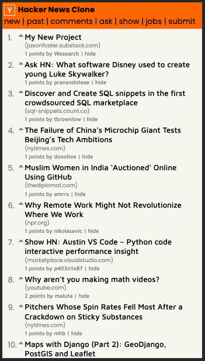
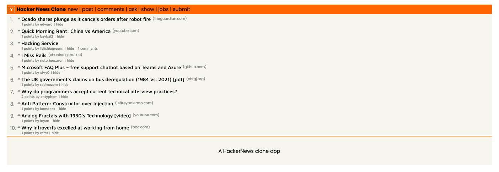

# Hackernews Clone APP

> A hackernews clone using Angular and Typescript

## Available Scripts

In the project directory, you can run:

### `npm install`

Installs package dependencies

### `npm start`

Runs the app in the development mode.\
Open [http://localhost:4200](http://localhost:4200) to view it in the browser.

### `npm run watch`

Runs the app in the development mode.\
Open [http://localhost:4200](http://localhost:4200) to view it in the browser.

The page will reload if you make edits.\
You will also see any lint errors in the console.

---

## Screenshots

